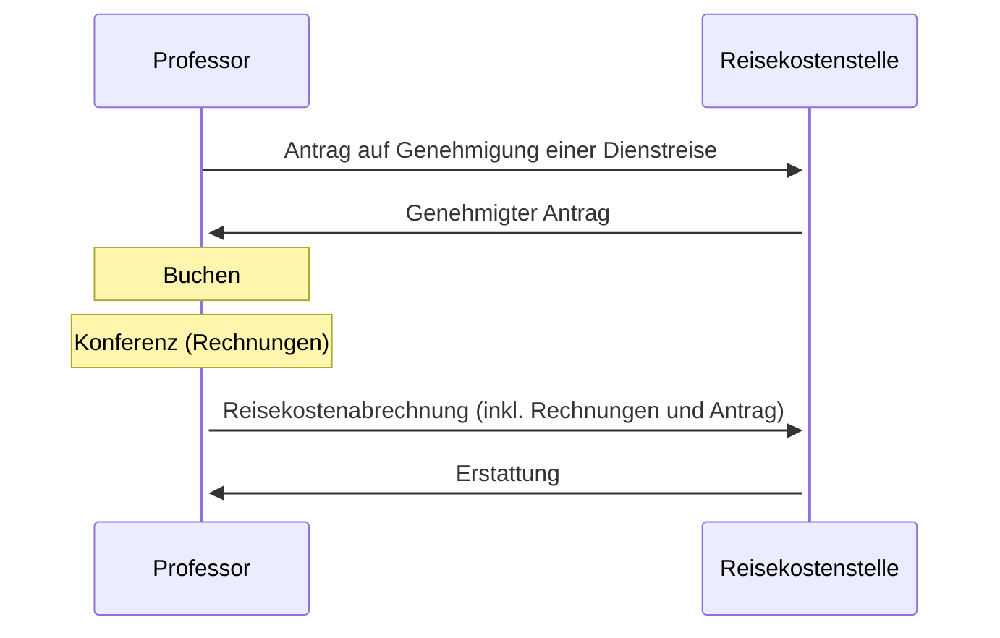

# 10.50 Travel

**Apply for a Business Trip:**

Application must be sent to Dept. III at least 2 weeks before the trip. For trips to non-European countries, send the application to the President's Office for approval first.
No reimbursement of travel expenses without the approved application, so take good care of it! 
- [Dienstreiseantrag](https://www.uni-bamberg.de/fileadmin/abt-personal/Homepage_ab_2016-03/11_Formulare_Infos_Merkblaetter/Reisekosten/Antrag_auf_Genehmigung_einer_Dienstreise.pdf)
- [Further Information](https://www.uni-bamberg.de/abt-personal/formulare-infos-und-merkblaetter/) -> Subcategory "Reisekosten"

Important rules:
    - Always book 2nd class
    - Traveling by plane or by car only permitted for good reasons
    - Note regulations for hotel costs [Informationen zu Reisekosten](https://www.uni-bamberg.de/fileadmin/abt-personal/Homepage_ab_2016-03/11_Formulare_Infos_Merkblaetter/Reisekosten/Neu-06-2022/Information%20zu%20Reisekosten.pdf)

**Reimbursement of Travel Expenses:**

Send reimbursement form together with original receipts (sorted and glued on DIN A 4 paper), credit card receipts and approved application to Dept. III/2 within 6 months after the trip.
- [Reisekostenabrechnung](https://www.uni-bamberg.de/fileadmin/abt-personal/Homepage_ab_2016-03/11_Formulare_Infos_Merkblaetter/Reisekosten/Reisekostenabrechnung-10-17.docx)

